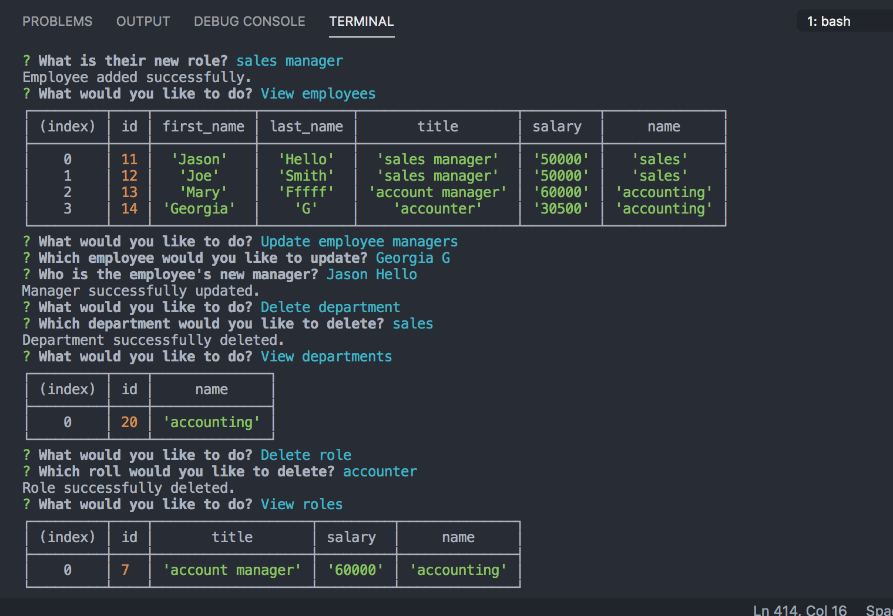

# Employee Tracker

[Link to full length video](https://drive.google.com/file/d/1qgGdz24_mya4yvGTtaFZ7EQJ1tK8f-ni/view)

## Description
Command line application which allows user to keep track of their business. Users can  enter departments, roles, and employees, update information, delete information, and view information. 

## Installation
To use this application, run `npm i` on your machine. This application also utilizes mySQL.

## License
Licensed under the [WTFPL](http://www.wtfpl.net/about/) license.
